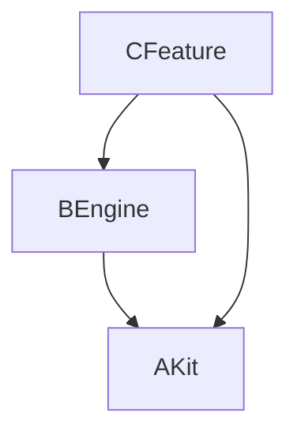

# RegenWS — Architecture

## Layers

<!-- WORKSPACE_LAYERS_BEGIN -->
| Group | api-contract | engine | library | feature |
|---|---|---|---|---|
| common | AKit | BEngine | — | — |
| domain | — | — | — | CFeature |
<!-- WORKSPACE_LAYERS_END -->

## Dependency graph

<!-- WORKSPACE_GRAPH_BEGIN -->

<!-- WORKSPACE_GRAPH_END -->

## Rationale

(manual section — describe why packages were sliced this way)
